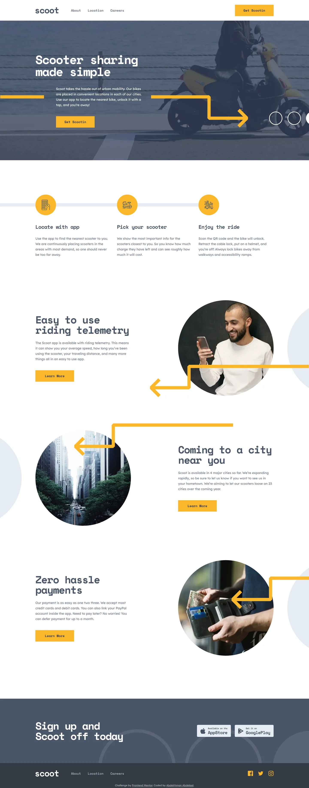

# Frontend Mentor - Scoot multi-page website solution

This is a solution to the [Scoot multi-page website challenge on Frontend Mentor](https://www.frontendmentor.io/challenges/scoot-multipage-website-N76alNPRJ). Frontend Mentor challenges help you improve your coding skills by building realistic projects.

## Table of contents

- [Overview](#overview)
  - [Screenshot](#screenshot)
  - [Links](#links)
- [My process](#my-process)
  - [Built with](#built-with)
  - [Design deviations](#design-deviations)
- [Author](#author)

## Overview

### Screenshot

### Links

- Solution URL: [GitHub](https://github.com/MrBlackvanta/scoot-multi-page-website)
- Live Site URL: [Cloudflare](https://scoot-multi-page-website.abdelrhman-ahmed8881.workers.dev)

## My process

### Built with

- [Next.js 16](https://nextjs.org/) (App Router, React Compiler, Turbopack, static export)
- [React 19](https://react.dev/)
- [TypeScript](https://www.typescriptlang.org/) (strict)
- [Tailwind CSS v4](https://tailwindcss.com/)

### Design deviations

Accessibility fixes, each the smallest change that clears WCAG AA. Ratios measured by
compositing on rounded 8-bit channels against the real backdrop.

| Element | Design | Shipped | Ratio |
| --- | --- | --- | --- |
| Body copy, header nav | `#939CAA` on white | `#6C7789` | 2.77 -> 4.53 |
| Footer nav links | `#939CAA` on `#333A44` | `#9AA3B0` | 4.14 -> 4.50 |
| Button label, tablet map pills | white on `#FCB72B` | `#333A44` | 1.76 -> 6.53 |
| Button hover label | `#FCB72B` on white | `#333A44` | 1.76 -> 11.48 |

Yellow-on-white cannot be fixed without turning the brand colour brown, so the button's
hover keeps the yellow border and swaps only the fill.

Documented and left as designed:

- The yellow button fill against the white page is 1.76:1 and the yellow map dots against the
  light-grey map are 1.48:1. Both are non-text; every city name is real text beside its dot, so
  no information is carried by colour alone.
- Tablet drops the map labels to 13px while mobile and desktop use 24px. Proportional to the
  map, and it clears 4.5:1.
- The hero's yellow connector arrow is drawn from 1280px up. It is 452px wide and needs the gap
  the 1440px frame leaves between the text column and the white circles; narrower than that it
  would cross the paragraph or the circles, so the desktop hero drops it rather than move it.
- **A hovered header nav link is `#FCB72B` on white in the design, which is 1.76:1.** It is left
  as drawn; the same yellow clears AA on the dark footer and drawer (6.53:1), so only the header
  is affected, and only while the pointer is on the link.
- The design has no current-page nav state. Added one, coloured per backdrop so each clears AA:
  `#333A44` on the white header (11.48:1), `#FCB72B` on the dark footer and drawer (6.53:1).
- The story panels' yellow connector arrows are hand-placed in the design, at a different offset
  per panel and per breakpoint. Two are moved: the home page's middle arrow sits 32px higher, or
  its long leg crosses "Coming to a city near you" once the heading wraps below 1100px; and the
  About page's first arrow follows the home page's placement, because that group is mirrored in
  the design file and its drawn position lands on the heading at mobile.
- On mobile, panel-one arrows are anchored to the bottom of their photo rather than to its top,
  so the arrowhead keeps sitting on the photo's edge as the photo narrows below 375px.
- The FAQ chevron is `#FCB72B` on `#F2F5F9`, 1.61:1. Left as drawn: it is non-text, the rows are
  native `
` so the state is exposed programmatically, and the answer appearing carries
  the same information visually.
- The value badges put `#495567` on `#FCB72B` at 4.31:1. That is below the 4.5:1 body threshold
  but the numerals are 24px bold, so 3:1 applies and they clear it.
- The design shows one FAQ row open per group. Built as independent disclosures rather than an
  exclusive accordion, so opening one answer never hides another; the first row of each group
  ships open to match the drawn state.
- Focus rings and the reduced-motion path are not in the design file.
- The Frontend Mentor attribution makes the mobile footer taller than the 438px drawn.

## Author

- UpWork - [Abdelrhman Abdelaal](https://www.upwork.com/freelancers/mrblackvanta)
- Frontend Mentor - [@MrBlackvanta](https://www.frontendmentor.io/profile/MrBlackvanta)
- LinkedIn - [Abdelrhman Abdelaal](https://www.linkedin.com/in/abdelrhman-vanta/)
